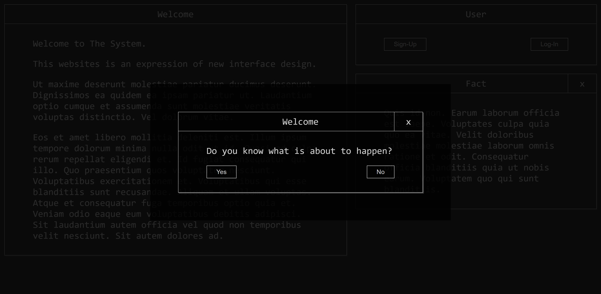

### system-ui

## System UI

System UI is the latest innovation in front-end engineering. We believe that form will follow function. The intention of this design system is to be a leap forward in usability.

## CSS Guidelines

- Use REM or % for width, height, padding, margins etc
- Use PX for border sizes
- Media queries should aim to always be min-width so that the original styles are mobile-first.
- Minimal SCSS nesting, prefer to keep selectors close together
- Aim to create a new scss file for each component, import components into `styles.scss`

## TODO

- [ ]  Images (Square, Circular)
- [ ]  Links/Anchors
- [ ]  Progress bars
- [ ]  Radio, Dropdown
- [ ]  Inputs
- [ ]  More Layouts
- [ ]  Whatever you want. If you like it, make a PR.
- [ ]  Navigation (Sidebars Toolbars)
- [ ]  Better CSS Breakpoints

## UI

## Development Guide

- Clone
- `yarn install`
- `yarn start`
    > Server running at http://localhost:1234 